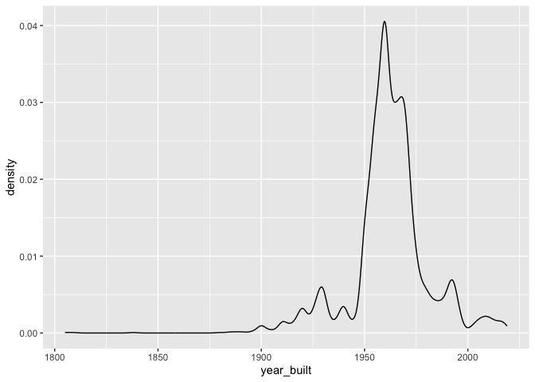
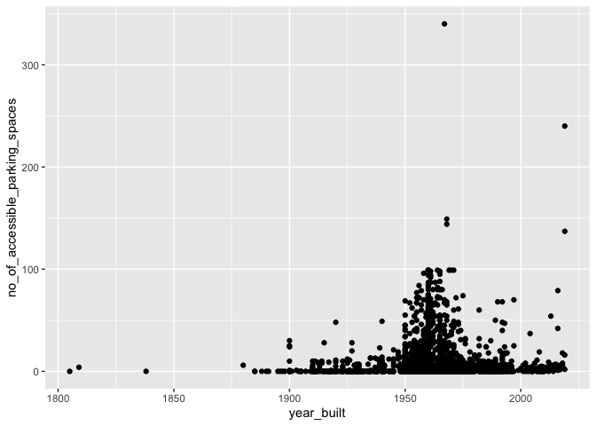

Mini Data-Analysis Deliverable 1
================
April Hwang

# Introduction

This is the Mini Data-Analysis Deliverable 1 for STATS 545A by April
Hwang. It demonstrates my knowledge in using dplyr and ggplot2.

### Load libraries, control message flow

``` r
suppressPackageStartupMessages(library(tidyverse)) #hide package start up message

library(tidyverse) #load tidyverse
library(datateachr) #load datateachr

knitr::opts_chunk$set(message = FALSE) #hide messages
knitr::opts_chunk$set(warning = FALSE) #hide warnings
```

<br>

# Task 1: Choosing the dataset

### 1.1 **(1 point)** Choose 4 datasets

<br>

1.  `apt_buildings`
2.  `parking_meters`
3.  `steam_games`
4.  `vancouver_trees`

<br>

### 1.2 **(6 points)** Find 3 attributes for each dataset

<br>

#### **Attribute 1 - class type**

``` r
class(apt_buildings)
```

    ## [1] "tbl_df"     "tbl"        "data.frame"

``` r
class(parking_meters)
```

    ## [1] "tbl_df"     "tbl"        "data.frame"

``` r
class(steam_games)
```

    ## [1] "spec_tbl_df" "tbl_df"      "tbl"         "data.frame"

``` r
class(vancouver_trees)
```

    ## [1] "tbl_df"     "tbl"        "data.frame"

<br>

#### **Attribute 2 - rows and columns**

``` r
glimpse(apt_buildings)
```

    ## Rows: 3,455
    ## Columns: 37
    ## $ id                               <dbl> 10359, 10360, 10361, 10362, 10363, 10…
    ## $ air_conditioning                 <chr> "NONE", "NONE", "NONE", "NONE", "NONE…
    ## $ amenities                        <chr> "Outdoor rec facilities", "Outdoor po…
    ## $ balconies                        <chr> "YES", "YES", "YES", "YES", "NO", "NO…
    ## $ barrier_free_accessibilty_entr   <chr> "YES", "NO", "NO", "YES", "NO", "NO",…
    ## $ bike_parking                     <chr> "0 indoor parking spots and 10 outdoo…
    ## $ exterior_fire_escape             <chr> "NO", "NO", "NO", "YES", "NO", NA, "N…
    ## $ fire_alarm                       <chr> "YES", "YES", "YES", "YES", "YES", "Y…
    ## $ garbage_chutes                   <chr> "YES", "YES", "NO", "NO", "NO", "NO",…
    ## $ heating_type                     <chr> "HOT WATER", "HOT WATER", "HOT WATER"…
    ## $ intercom                         <chr> "YES", "YES", "YES", "YES", "YES", "Y…
    ## $ laundry_room                     <chr> "YES", "YES", "YES", "YES", "YES", "Y…
    ## $ locker_or_storage_room           <chr> "NO", "YES", "YES", "YES", "NO", "YES…
    ## $ no_of_elevators                  <dbl> 3, 3, 0, 1, 0, 0, 0, 2, 4, 2, 0, 2, 2…
    ## $ parking_type                     <chr> "Underground Garage , Garage accessib…
    ## $ pets_allowed                     <chr> "YES", "YES", "YES", "YES", "YES", "Y…
    ## $ prop_management_company_name     <chr> NA, "SCHICKEDANZ BROS. PROPERTIES", N…
    ## $ property_type                    <chr> "PRIVATE", "PRIVATE", "PRIVATE", "PRI…
    ## $ rsn                              <dbl> 4154812, 4154815, 4155295, 4155309, 4…
    ## $ separate_gas_meters              <chr> "NO", "NO", "NO", "NO", "NO", "NO", "…
    ## $ separate_hydro_meters            <chr> "YES", "YES", "YES", "YES", "YES", "Y…
    ## $ separate_water_meters            <chr> "NO", "NO", "NO", "NO", "NO", "NO", "…
    ## $ site_address                     <chr> "65  FOREST MANOR RD", "70  CLIPPER R…
    ## $ sprinkler_system                 <chr> "YES", "YES", "NO", "YES", "NO", "NO"…
    ## $ visitor_parking                  <chr> "PAID", "FREE", "UNAVAILABLE", "UNAVA…
    ## $ ward                             <chr> "17", "17", "03", "03", "02", "02", "…
    ## $ window_type                      <chr> "DOUBLE PANE", "DOUBLE PANE", "DOUBLE…
    ## $ year_built                       <dbl> 1967, 1970, 1927, 1959, 1943, 1952, 1…
    ## $ year_registered                  <dbl> 2017, 2017, 2017, 2017, 2017, NA, 201…
    ## $ no_of_storeys                    <dbl> 17, 14, 4, 5, 4, 4, 4, 7, 32, 4, 4, 7…
    ## $ emergency_power                  <chr> "NO", "YES", "NO", "NO", "NO", "NO", …
    ## $ `non-smoking_building`           <chr> "YES", "NO", "YES", "YES", "YES", "NO…
    ## $ no_of_units                      <dbl> 218, 206, 34, 42, 25, 34, 14, 105, 57…
    ## $ no_of_accessible_parking_spaces  <dbl> 8, 10, 20, 42, 12, 0, 5, 1, 1, 6, 12,…
    ## $ facilities_available             <chr> "Recycling bins", "Green Bin / Organi…
    ## $ cooling_room                     <chr> "NO", "NO", "NO", "NO", "NO", "NO", "…
    ## $ no_barrier_free_accessible_units <dbl> 2, 0, 0, 42, 0, NA, 14, 0, 0, 1, 25, …

``` r
glimpse(parking_meters)
```

    ## Rows: 10,032
    ## Columns: 22
    ## $ meter_head     <chr> "Twin", "Pay Station", "Twin", "Single", "Twin", "Twin"…
    ## $ r_mf_9a_6p     <chr> "$2.00", "$1.00", "$1.00", "$1.00", "$2.00", "$2.00", "…
    ## $ r_mf_6p_10     <chr> "$4.00", "$1.00", "$1.00", "$1.00", "$1.00", "$1.00", "…
    ## $ r_sa_9a_6p     <chr> "$2.00", "$1.00", "$1.00", "$1.00", "$2.00", "$2.00", "…
    ## $ r_sa_6p_10     <chr> "$4.00", "$1.00", "$1.00", "$1.00", "$1.00", "$1.00", "…
    ## $ r_su_9a_6p     <chr> "$2.00", "$1.00", "$1.00", "$1.00", "$2.00", "$2.00", "…
    ## $ r_su_6p_10     <chr> "$4.00", "$1.00", "$1.00", "$1.00", "$1.00", "$1.00", "…
    ## $ rate_misc      <chr> NA, "$ .50", NA, NA, NA, NA, NA, NA, NA, NA, NA, NA, NA…
    ## $ time_in_effect <chr> "METER IN EFFECT: 9:00 AM TO 10:00 PM", "METER IN EFFEC…
    ## $ t_mf_9a_6p     <chr> "2 Hr", "10 Hrs", "2 Hr", "2 Hr", "2 Hr", "3 Hr", "2 Hr…
    ## $ t_mf_6p_10     <chr> "4 Hr", "10 Hrs", "4 Hr", "4 Hr", "4 Hr", "4 Hr", "4 Hr…
    ## $ t_sa_9a_6p     <chr> "2 Hr", "10 Hrs", "2 Hr", "2 Hr", "2 Hr", "3 Hr", "2 Hr…
    ## $ t_sa_6p_10     <chr> "4 Hr", "10 Hrs", "4 Hr", "4 Hr", "4 Hr", "4 Hr", "4 Hr…
    ## $ t_su_9a_6p     <chr> "2 Hr", "10 Hrs", "2 Hr", "2 Hr", "2 Hr", "3 Hr", "2 Hr…
    ## $ t_su_6p_10     <chr> "4 Hr", "10 Hrs", "4 Hr", "4 Hr", "4 Hr", "4 Hr", "4 Hr…
    ## $ time_misc      <chr> NA, "No Time Limit", NA, NA, NA, NA, NA, NA, NA, NA, NA…
    ## $ credit_card    <chr> "No", "Yes", "No", "No", "No", "No", "No", "No", "No", …
    ## $ pay_phone      <chr> "66890", "59916", "57042", "57159", "51104", "60868", "…
    ## $ longitude      <dbl> -123.1289, -123.0982, -123.1013, -123.1862, -123.1278, …
    ## $ latitude       <dbl> 49.28690, 49.27215, 49.25468, 49.26341, 49.26354, 49.27…
    ## $ geo_local_area <chr> "West End", "Strathcona", "Riley Park", "West Point Gre…
    ## $ meter_id       <chr> "670805", "471405", "C80145", "D03704", "301023", "5913…

``` r
glimpse(steam_games)
```

    ## Rows: 40,833
    ## Columns: 21
    ## $ id                       <dbl> 1, 2, 3, 4, 5, 6, 7, 8, 9, 10, 11, 12, 13, 14…
    ## $ url                      <chr> "https://store.steampowered.com/app/379720/DO…
    ## $ types                    <chr> "app", "app", "app", "app", "app", "bundle", …
    ## $ name                     <chr> "DOOM", "PLAYERUNKNOWN'S BATTLEGROUNDS", "BAT…
    ## $ desc_snippet             <chr> "Now includes all three premium DLC packs (Un…
    ## $ recent_reviews           <chr> "Very Positive,(554),- 89% of the 554 user re…
    ## $ all_reviews              <chr> "Very Positive,(42,550),- 92% of the 42,550 u…
    ## $ release_date             <chr> "May 12, 2016", "Dec 21, 2017", "Apr 24, 2018…
    ## $ developer                <chr> "id Software", "PUBG Corporation", "Harebrain…
    ## $ publisher                <chr> "Bethesda Softworks,Bethesda Softworks", "PUB…
    ## $ popular_tags             <chr> "FPS,Gore,Action,Demons,Shooter,First-Person,…
    ## $ game_details             <chr> "Single-player,Multi-player,Co-op,Steam Achie…
    ## $ languages                <chr> "English,French,Italian,German,Spanish - Spai…
    ## $ achievements             <dbl> 54, 37, 128, NA, NA, NA, 51, 55, 34, 43, 72, …
    ## $ genre                    <chr> "Action", "Action,Adventure,Massively Multipl…
    ## $ game_description         <chr> "About This Game Developed by id software, th…
    ## $ mature_content           <chr> NA, "Mature Content Description  The develope…
    ## $ minimum_requirements     <chr> "Minimum:,OS:,Windows 7/8.1/10 (64-bit versio…
    ## $ recommended_requirements <chr> "Recommended:,OS:,Windows 7/8.1/10 (64-bit ve…
    ## $ original_price           <dbl> 19.99, 29.99, 39.99, 44.99, 0.00, NA, 59.99, …
    ## $ discount_price           <dbl> 14.99, NA, NA, NA, NA, 35.18, 70.42, 17.58, N…

``` r
glimpse(vancouver_trees)
```

    ## Rows: 146,611
    ## Columns: 20
    ## $ tree_id            <dbl> 149556, 149563, 149579, 149590, 149604, 149616, 149…
    ## $ civic_number       <dbl> 494, 450, 4994, 858, 5032, 585, 4909, 4925, 4969, 7…
    ## $ std_street         <chr> "W 58TH AV", "W 58TH AV", "WINDSOR ST", "E 39TH AV"…
    ## $ genus_name         <chr> "ULMUS", "ZELKOVA", "STYRAX", "FRAXINUS", "ACER", "…
    ## $ species_name       <chr> "AMERICANA", "SERRATA", "JAPONICA", "AMERICANA", "C…
    ## $ cultivar_name      <chr> "BRANDON", NA, NA, "AUTUMN APPLAUSE", NA, "CHANTICL…
    ## $ common_name        <chr> "BRANDON ELM", "JAPANESE ZELKOVA", "JAPANESE SNOWBE…
    ## $ assigned           <chr> "N", "N", "N", "Y", "N", "N", "N", "N", "N", "N", "…
    ## $ root_barrier       <chr> "N", "N", "N", "N", "N", "N", "N", "N", "N", "N", "…
    ## $ plant_area         <chr> "N", "N", "4", "4", "4", "B", "6", "6", "3", "3", "…
    ## $ on_street_block    <dbl> 400, 400, 4900, 800, 5000, 500, 4900, 4900, 4900, 7…
    ## $ on_street          <chr> "W 58TH AV", "W 58TH AV", "WINDSOR ST", "E 39TH AV"…
    ## $ neighbourhood_name <chr> "MARPOLE", "MARPOLE", "KENSINGTON-CEDAR COTTAGE", "…
    ## $ street_side_name   <chr> "EVEN", "EVEN", "EVEN", "EVEN", "EVEN", "ODD", "ODD…
    ## $ height_range_id    <dbl> 2, 4, 3, 4, 2, 2, 3, 3, 2, 2, 2, 5, 3, 2, 2, 2, 2, …
    ## $ diameter           <dbl> 10.00, 10.00, 4.00, 18.00, 9.00, 5.00, 15.00, 14.00…
    ## $ curb               <chr> "N", "N", "Y", "Y", "Y", "Y", "Y", "Y", "Y", "Y", "…
    ## $ date_planted       <date> 1999-01-13, 1996-05-31, 1993-11-22, 1996-04-29, 19…
    ## $ longitude          <dbl> -123.1161, -123.1147, -123.0846, -123.0870, -123.08…
    ## $ latitude           <dbl> 49.21776, 49.21776, 49.23938, 49.23469, 49.23894, 4…

<br>

#### **Attribute 3 - count unique dataset in column**

``` r
#count unique dataset in apt_buildings
apt_summary_tbl <- summarise(apt_buildings, across(c(id:no_barrier_free_accessible_units), n_distinct)) 

apt_long_summary_tbl <- apt_summary_tbl %>% pivot_longer(cols = everything(), names_to = 'variable_name', values_to = 'n_distinct')
print(apt_long_summary_tbl, n = 37)
```

    ## # A tibble: 37 × 2
    ##    variable_name                    n_distinct
    ##    <chr>                                 <int>
    ##  1 id                                     3455
    ##  2 air_conditioning                          4
    ##  3 amenities                                70
    ##  4 balconies                                 3
    ##  5 barrier_free_accessibilty_entr            3
    ##  6 bike_parking                            195
    ##  7 exterior_fire_escape                      3
    ##  8 fire_alarm                                3
    ##  9 garbage_chutes                            3
    ## 10 heating_type                              4
    ## 11 intercom                                  3
    ## 12 laundry_room                              3
    ## 13 locker_or_storage_room                    3
    ## 14 no_of_elevators                          11
    ## 15 parking_type                             42
    ## 16 pets_allowed                              3
    ## 17 prop_management_company_name            692
    ## 18 property_type                             3
    ## 19 rsn                                    3455
    ## 20 separate_gas_meters                       3
    ## 21 separate_hydro_meters                     3
    ## 22 separate_water_meters                     3
    ## 23 site_address                           3445
    ## 24 sprinkler_system                          3
    ## 25 visitor_parking                           5
    ## 26 ward                                     26
    ## 27 window_type                               4
    ## 28 year_built                              128
    ## 29 year_registered                           5
    ## 30 no_of_storeys                            38
    ## 31 emergency_power                           3
    ## 32 non-smoking_building                      3
    ## 33 no_of_units                             380
    ## 34 no_of_accessible_parking_spaces          94
    ## 35 facilities_available                      4
    ## 36 cooling_room                              3
    ## 37 no_barrier_free_accessible_units        167

``` r
#count unique dataset in parking_meters
parking_summary_tbl <- summarise(parking_meters, across(c(meter_head:meter_id), n_distinct))

parking_long_summary_tbl <- parking_summary_tbl %>% pivot_longer(cols = everything(), names_to = 'variable_name', values_to = 'n_distinct')
print(parking_long_summary_tbl, n = 22)
```

    ## # A tibble: 22 × 2
    ##    variable_name  n_distinct
    ##    <chr>               <int>
    ##  1 meter_head              7
    ##  2 r_mf_9a_6p             14
    ##  3 r_mf_6p_10             13
    ##  4 r_sa_9a_6p             14
    ##  5 r_sa_6p_10             13
    ##  6 r_su_9a_6p             15
    ##  7 r_su_6p_10             14
    ##  8 rate_misc               9
    ##  9 time_in_effect          2
    ## 10 t_mf_9a_6p              8
    ## 11 t_mf_6p_10              8
    ## 12 t_sa_9a_6p              8
    ## 13 t_sa_6p_10              8
    ## 14 t_su_9a_6p              8
    ## 15 t_su_6p_10              9
    ## 16 time_misc               5
    ## 17 credit_card             3
    ## 18 pay_phone           10029
    ## 19 longitude            5671
    ## 20 latitude             5671
    ## 21 geo_local_area         18
    ## 22 meter_id            10032

``` r
#count unique dataset in steam_games
games_summary_tbl <- summarise(steam_games, across(c(id:discount_price), n_distinct))

games_long_summary_tbl <- games_summary_tbl %>% pivot_longer(cols = everything(), names_to = 'variable_name', values_to = 'n_distinct')
print(games_long_summary_tbl, n = 21)
```

    ## # A tibble: 21 × 2
    ##    variable_name            n_distinct
    ##    <chr>                         <int>
    ##  1 id                            40833
    ##  2 url                           40833
    ##  3 types                             4
    ##  4 name                          40752
    ##  5 desc_snippet                  27412
    ##  6 recent_reviews                 1301
    ##  7 all_reviews                    9211
    ##  8 release_date                   4110
    ##  9 developer                     17419
    ## 10 publisher                     15282
    ## 11 popular_tags                  20854
    ## 12 game_details                   6017
    ## 13 languages                      5497
    ## 14 achievements                    361
    ## 15 genre                          1769
    ## 16 game_description              37497
    ## 17 mature_content                 1263
    ## 18 minimum_requirements          14765
    ## 19 recommended_requirements      13839
    ## 20 original_price                  436
    ## 21 discount_price                 2061

``` r
#count unique dataset in vancouver_trees
trees_summary_tbl <- summarise(vancouver_trees, across(c(tree_id:latitude), n_distinct))

trees_long_summary_tbl <- games_summary_tbl %>% pivot_longer(cols = everything(), names_to = 'variable_name', values_to = 'n_distinct')
print(trees_long_summary_tbl, n = 20)
```

    ## # A tibble: 21 × 2
    ##    variable_name            n_distinct
    ##    <chr>                         <int>
    ##  1 id                            40833
    ##  2 url                           40833
    ##  3 types                             4
    ##  4 name                          40752
    ##  5 desc_snippet                  27412
    ##  6 recent_reviews                 1301
    ##  7 all_reviews                    9211
    ##  8 release_date                   4110
    ##  9 developer                     17419
    ## 10 publisher                     15282
    ## 11 popular_tags                  20854
    ## 12 game_details                   6017
    ## 13 languages                      5497
    ## 14 achievements                    361
    ## 15 genre                          1769
    ## 16 game_description              37497
    ## 17 mature_content                 1263
    ## 18 minimum_requirements          14765
    ## 19 recommended_requirements      13839
    ## 20 original_price                  436
    ## # ℹ 1 more row

<br>

### 1.3 **(1 point)** Choose 1 dataset and explain your choice

I have chosen `apt_buildings` as the columns and rows are labelled
intuitively. I have eliminated the other datasets such as
`parking_meters` which contain many code columns such as *r_mf_9a_6p*
and `vancouver_trees` which contain ambiguous columns such as
*assigned*. More importantly, I am most interested in the information in
this dataset and feel that I can think of four research questions as
indicated in the learning objectives.

<br>

### 1.4 **(2 points)** Think of 1 research question for your dataset

One research question that I would like to explore with this dataset is
whether attitude towards pets have changed over the years by looking
into the relationship between *year_built* and *pets_allowed*. I would
look into a correlation plot to see if there has been an increase or
decrease in the percentage of pet friendly buildings that were built
over the years. This data can help to formulate a supporting argument
for an assertion of whether there appears to be a change in attitude
towards pet ownership.

<br>

# Task 2: Exploring your dataset

### 2.1 & 2.2 **(12 points)** **(4 points)** Complete 4 exercises, and provide an explanation and comments for each exercise

<br>

#### **Exercise 1 - plot the distribution of a numeric variable**

This this exercise, I will plot the distribution of the *year_built*
variable.

I chose the *year_built* variable because the this is a variable which
can be used to answer a number of different interesting research
questions. For example, you can look at the correlation data between
*year_built* and another variable (e.g. *pets_allowed,
no_of_accessible_parking_spaces, non-smoking_building*, etc.) to see if
there is an emerging pattern which may indicate a sociological shift
such as more positive attitude towards pets or negative attitude towards
pet ownership, as previously discussed, as well as other factors such as
consideration for accessibility needs and smoking.

``` r
apt_buildings %>%
ggplot(aes(x = year_built)) + 
    geom_density()
```

<!-- -->

<br>

#### **Exercise 2 - investigate number of missing values per variable and plot this**

I chose this exercise because investigating how many missing values
there are per variable is something that I have frequently had to do in
the past during data analysis. I used to use the excel “find” function,
however, this is a more efficient way of accomplishing the same task.
Additionally, it can be interesting to look into the implications of
missing data, in that the amount of data available itself may be
pertinent to a research question.

``` r
apply(X = is.na(apt_buildings), MARGIN = 2, FUN = sum)
```

    ##                               id                 air_conditioning 
    ##                                0                               85 
    ##                        amenities                        balconies 
    ##                             2518                               88 
    ##   barrier_free_accessibilty_entr                     bike_parking 
    ##                               82                                0 
    ##             exterior_fire_escape                       fire_alarm 
    ##                               95                               87 
    ##                   garbage_chutes                     heating_type 
    ##                               83                               86 
    ##                         intercom                     laundry_room 
    ##                               90                               85 
    ##           locker_or_storage_room                  no_of_elevators 
    ##                               88                                5 
    ##                     parking_type                     pets_allowed 
    ##                              350                               90 
    ##     prop_management_company_name                    property_type 
    ##                             1363                                0 
    ##                              rsn              separate_gas_meters 
    ##                                0                               88 
    ##            separate_hydro_meters            separate_water_meters 
    ##                               87                               87 
    ##                     site_address                 sprinkler_system 
    ##                                0                               87 
    ##                  visitor_parking                             ward 
    ##                               87                                0 
    ##                      window_type                       year_built 
    ##                                8                               13 
    ##                  year_registered                    no_of_storeys 
    ##                               89                                0 
    ##                  emergency_power             non-smoking_building 
    ##                               86                               94 
    ##                      no_of_units  no_of_accessible_parking_spaces 
    ##                                0                              123 
    ##             facilities_available                     cooling_room 
    ##                                0                               88 
    ## no_barrier_free_accessible_units 
    ##                              154

RE: plotting - as per Lucy’s message on Slack “I’m going to say that
it’s okay to answer this question by (1) investigating by summary and
(2) to say what the plot would look like, i.e. you don’t have to make
the plot if you don’t want to.”:

The summary table shows that there are some columns without any missing
data (e.g. *id, bike_parking, property_type, rsn*) whereas others have
significant number of missing data (e.g. *amenities,
prop_management_company_name*). The fact that some columns have more
missing information than others can lend itself to a research question,
in that it may imply that the data was difficult to attain, the
information is generally deemed as of lower importance, or some form of
ambiguity in the information being required to collect.

If the above summary table was to be plotted, it would have the columns
in the x-axis and the number of missing data on the y-axis. The x-axis
would be organized in an ascending manner (i.e. columns which have no
missing information would be situated on the far left side and the
column with the most number of missing information would be situated on
the far right side). Various types of graphs, such scatter plot, line or
even bar graph, would generally be suitable for this data.

<br>

#### **Exercise 3 - explore the relationship between 2 variables in a plot**

For this exercise, I will explore the relationship between
*no_of_accessible_parking_spaces* and *year_built*.

I chose this exercise because another potential research question that I
can explore is looking into the relationship between time and number of
accessible parking spaces. This may be pertinent information as part of
an inquiry regarding availability of accessibility facilities for people
with physical disabilities over time.

``` r
apt_buildings %>%
ggplot(aes(x = year_built, y = no_of_accessible_parking_spaces)) +
    geom_point()
```

<!-- -->

<br>

#### **Exercise 4 - make a new tibble with a subset of your data, with variables and observations that you are interested in exploring**

For this exercise, I will be making a new tibble with year_built and
pets_allowed only, arrange by year.

I chose this exercise because, as mentioned above, one research question
that I am interested in exploring is the relationship between the year
that a building was built and allowance for pet to examine if there is a
correlation between time and pet allowance. This new tibble will provide
a quick glimpse of the relevant data and can be further manipulated in
the future to make a graph.

``` r
apt_buildings %>%
  select(year_built, pets_allowed) %>%
  arrange(year_built)
```

    ## # A tibble: 3,455 × 2
    ##    year_built pets_allowed
    ##         <dbl> <chr>       
    ##  1       1805 YES         
    ##  2       1809 YES         
    ##  3       1838 YES         
    ##  4       1880 YES         
    ##  5       1885 YES         
    ##  6       1885 YES         
    ##  7       1888 YES         
    ##  8       1890 YES         
    ##  9       1891 YES         
    ## 10       1895 NO          
    ## # ℹ 3,445 more rows

<br>

# Task 3: Choose research questions

### **(4 points)** Write 4 research questions that you would like to explore in Milestone 2

<br>

**Research question 1** : What, if any, is the relationship between time
and allowance of pet ownership in this dataset? Similarly, is there any
relationship between time and availability of accessible parking?

**Research question 2** : Is there a relationship between the number of
units and the number of storeys?

**Research question 3** : What are the variables for which information
is most readily available (i.e. no missing data) and least readily
available (i.e. large amount of missing data)?

**Research question 4** : What are the top three most popular building
amenities?
