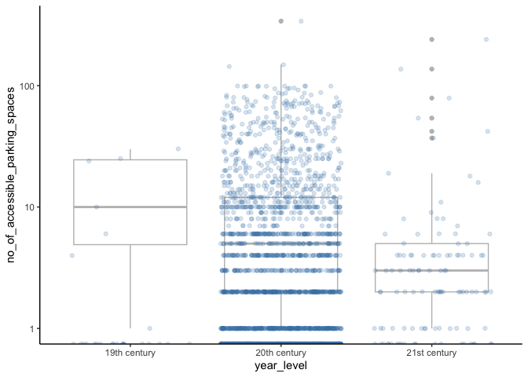
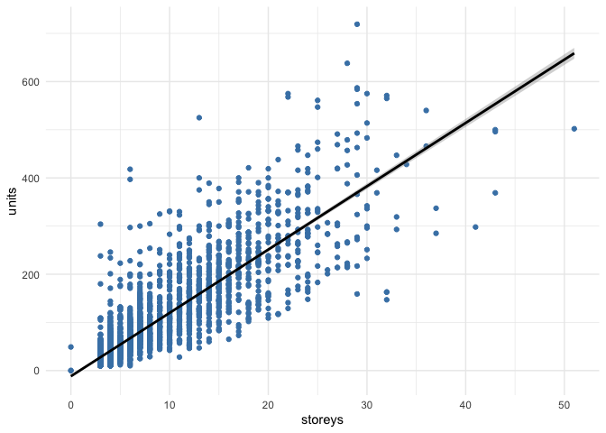

Mini Data Analysis Milestone 2
================
April Hwang

# Introduction

This is the Mini Data-Analysis Deliverable 2 for STATS 545A by April
Hwang. It demonstrates my knowledge in making summary tables/graphs,
manipulating data, model fitting, and reading/writing data as separate
files.

### load library, control message flow

``` r
library(tidyverse) 
library(datateachr) 
library(broom) 
library(here)

knitr::opts_chunk$set(message = FALSE) #hide messages
knitr::opts_chunk$set(warning = FALSE) #hide warnings
```

<br>

# Task 1: Process and summarize data

### 1.1 (1 point): Write research questions from milestone 1

**Research question 1** : What, if any, is the relationship between time
and allowance of pet ownership in this dataset? Similarly, is there any
relationship between time and availability of accessible parking?

**Research question 2** : Is there a relationship between the number of
units and the number of storeys?

**Research question 3** : What are the variables for which information
is most readily available (i.e. no missing data) and least readily
available (i.e. large amount of missing data)?

**Research question 4** : What are the top three most popular building
amenities?

<br>

### 1.2 (8 points) For each research question, choose one summarising task and one graphing task

<br>

#### **Research question 1** : What, if any, is the relationship between time and allowance of pet ownership in this dataset? Similarly, is there any relationship between time and availability of accessible parking?

<br>

##### **Summarizing**: Create a categorical variable with 3 or more groups from an existing numerical variable.

I will create a new categorical variable, *year_level*, which identifies
the century in which the building was built as *19th century*, *20th
century*, and *21st century*.

``` r
#create year_level and move it forward as first column
apt_buildings %>%
  mutate(year_level = case_when(year_built < 1901 ~ '19th century',
                                year_built < 2001 ~ '20th century', 
                                TRUE ~ '21st century')) %>%
  relocate(year_level)
```

    ## # A tibble: 3,455 × 38
    ##    year_level     id air_conditioning amenities balconies barrier_free_accessi…¹
    ##    <chr>       <dbl> <chr>            <chr>     <chr>     <chr>                 
    ##  1 20th centu… 10359 NONE             Outdoor … YES       YES                   
    ##  2 20th centu… 10360 NONE             Outdoor … YES       NO                    
    ##  3 20th centu… 10361 NONE             <NA>      YES       NO                    
    ##  4 20th centu… 10362 NONE             <NA>      YES       YES                   
    ##  5 20th centu… 10363 NONE             <NA>      NO        NO                    
    ##  6 20th centu… 10364 NONE             <NA>      NO        NO                    
    ##  7 20th centu… 10365 NONE             <NA>      NO        YES                   
    ##  8 20th centu… 10366 CENTRAL AIR      Indoor p… YES       NO                    
    ##  9 20th centu… 10367 NONE             <NA>      YES       YES                   
    ## 10 20th centu… 10368 NONE             Indoor r… YES       YES                   
    ## # ℹ 3,445 more rows
    ## # ℹ abbreviated name: ¹​barrier_free_accessibilty_entr
    ## # ℹ 32 more variables: bike_parking <chr>, exterior_fire_escape <chr>,
    ## #   fire_alarm <chr>, garbage_chutes <chr>, heating_type <chr>, intercom <chr>,
    ## #   laundry_room <chr>, locker_or_storage_room <chr>, no_of_elevators <dbl>,
    ## #   parking_type <chr>, pets_allowed <chr>, prop_management_company_name <chr>,
    ## #   property_type <chr>, rsn <dbl>, separate_gas_meters <chr>, …

<br>

##### **Graphing**: Create a graph that has at least two geom layers.

I will create a graph using the above *year_level* on the x-axis and
*no_of_accessible_parking_spaces* on the y-axis. I will use
`geom_boxplot()` and `geom_jitter()`. I will also remove a few extreme
outliers that contain potentially questionable values of having over 150
accessible parking spaces.

``` r
#create graph using geom_boxplot() and geom_jitter()
apt_buildings %>%
  mutate(year_level = case_when(year_built < 1901 ~ '19th century',
                                year_built < 2001 ~ '20th century', 
                                TRUE ~ '21st century')) %>%
  ggplot(aes(x = year_level, y = no_of_accessible_parking_spaces)) + 
  geom_boxplot(colour = 'grey') +
  geom_jitter(alpha = 0.2, colour = 'steelblue') + 
  scale_y_log10('no_of_accessible_parking_spaces') +
  theme_classic()
```

<!-- -->

<br> <br>

#### **Research question 2** : Is there a relationship between the number of units and the number of storeys?

<br>

##### **Summarizing**: Create a categorical variable with 3 or more groups from an existing numerical variable.

I will create a new categorical variable, *rise_level*, which classifies
each building as *low-rise*, *mid-rise* or *high-rise*. For this
exercise, low-rise buildings will be defined as buildings with 10 floors
or under. Mid-rise buildings are defined as buildings that have between
11 to 15 floors. High-rise buildings are defined as buildings that have
16 floors or above.

``` r
#create rise_level and move it forward as first column
apt_buildings %>%
  mutate(rise_level = case_when(no_of_storeys < 11 ~ 'low-rise',
                                no_of_storeys < 16 ~ 'mid-rise', 
                                TRUE ~ 'high-rise')) %>%
  relocate(rise_level)
```

    ## # A tibble: 3,455 × 38
    ##    rise_level    id air_conditioning amenities  balconies barrier_free_accessi…¹
    ##    <chr>      <dbl> <chr>            <chr>      <chr>     <chr>                 
    ##  1 high-rise  10359 NONE             Outdoor r… YES       YES                   
    ##  2 mid-rise   10360 NONE             Outdoor p… YES       NO                    
    ##  3 low-rise   10361 NONE             <NA>       YES       NO                    
    ##  4 low-rise   10362 NONE             <NA>       YES       YES                   
    ##  5 low-rise   10363 NONE             <NA>       NO        NO                    
    ##  6 low-rise   10364 NONE             <NA>       NO        NO                    
    ##  7 low-rise   10365 NONE             <NA>       NO        YES                   
    ##  8 low-rise   10366 CENTRAL AIR      Indoor po… YES       NO                    
    ##  9 high-rise  10367 NONE             <NA>       YES       YES                   
    ## 10 low-rise   10368 NONE             Indoor re… YES       YES                   
    ## # ℹ 3,445 more rows
    ## # ℹ abbreviated name: ¹​barrier_free_accessibilty_entr
    ## # ℹ 32 more variables: bike_parking <chr>, exterior_fire_escape <chr>,
    ## #   fire_alarm <chr>, garbage_chutes <chr>, heating_type <chr>, intercom <chr>,
    ## #   laundry_room <chr>, locker_or_storage_room <chr>, no_of_elevators <dbl>,
    ## #   parking_type <chr>, pets_allowed <chr>, prop_management_company_name <chr>,
    ## #   property_type <chr>, rsn <dbl>, separate_gas_meters <chr>, …

<br>

##### **Graphing**: Create a graph that has at least two geom layers.

I will create a graph using `geom_jitter()` and `geom_smooth()`,
incorporating the variable created above, *rise_level*. I will remove
one outlier that is listed as having over 4000 units, which may be an
error.

``` r
#create graph using geom_jitter() and geom_smooth()
apt_buildings %>%
  mutate(rise_level = case_when(no_of_storeys < 11 ~ 'low-rise',
                                no_of_storeys < 16 ~ 'mid-rise', 
                                TRUE ~ 'high-rise')) %>%
  ggplot(aes(x = no_of_units, y = no_of_storeys, colour = rise_level)) + 
  geom_jitter(outlier.shape = NA, alpha = 0.2) +
  coord_cartesian(xlim =  c(0, 700)) +
  geom_smooth() +
  theme_classic()
```

<!-- -->

<br> <br>

#### **Research question 3** : What are the variables for which information is most readily available (i.e. no missing data) and least readily available (i.e. large amount of missing data)?

<br>

##### **Summarizing**: Compute the number of observations for at least one of your categorical variables.

For this task, I will compute the number of NAs for all variables in
`apt_buildings` and generate a new tibble with the new observations. I
will also count the total number of levels as a reference.

``` r
#count NA and tidy data
apt_buildings_NA <- apt_buildings %>%
  summarise(across(everything(), ~ sum(is.na(.)))) %>% 
  pivot_longer(cols = everything(), names_to = 'col_name', values_to = 'NA_count') 

print(apt_buildings_NA)
```

    ## # A tibble: 37 × 2
    ##    col_name                       NA_count
    ##    <chr>                             <int>
    ##  1 id                                    0
    ##  2 air_conditioning                     85
    ##  3 amenities                          2518
    ##  4 balconies                            88
    ##  5 barrier_free_accessibilty_entr       82
    ##  6 bike_parking                          0
    ##  7 exterior_fire_escape                 95
    ##  8 fire_alarm                           87
    ##  9 garbage_chutes                       83
    ## 10 heating_type                         86
    ## # ℹ 27 more rows

``` r
#convert apt_building_NA to fct and count levels
as.factor(apt_buildings_NA$col_name) %>%
  nlevels()
```

    ## [1] 37

<br>

##### **Graphing**: Create a graph of your choosing, make one of the axes logarithmic, and format the axes labels so that they are “pretty” or easier to read.

I will create a bar graph using `geom_col` which shows five columns with
the highest NA counts. The y-axis will be logarithmic. It will be
arranged in a descending order and will include clean and
non-overlapping x- and y-axis labels as well as a title for the graph.

``` r
#count NA and  tidy data
apt_buildings_NA <- apt_buildings %>%
  summarise(across(everything(), ~ sum(is.na(.)))) %>% 
  pivot_longer(cols = everything(), names_to = 'col_name', values_to = 'NA_count') %>%
  arrange(desc(NA_count))

#select 5 columns with highest NA counts
apt_buildings_NA %>%
  slice_max(NA_count, n = 5) %>%

  #shorten column names
  mutate(col_name = fct_recode(col_name, 
                               'prop_management' = 'prop_management_company_name',
                               'accessible_parking' = 'no_of_accessible_parking_spaces',
                               'barrier_free_accessible_units' = 'no_barrier_free_accessible_units')) %>%

  #plot graph
  ggplot(aes(x = fct_rev(fct_reorder(col_name, NA_count)), y = NA_count)) +
  geom_col(fill = 'steelblue') +
  scale_x_discrete(guide = guide_axis(n.dodge=2)) +
  ggtitle('Columns with Highest NA Count') +
  xlab('Column') + 
  ylab('NA count') +
  theme_minimal()
```

<!-- -->

<br> <br>

#### **Research question 4** : What are the top three most popular building amenities?

<br>

##### **Summary**: Compute the number of observations for at least one of your categorical variables.

I will convert the *amenities* variable to a factor, then compute the
counts of each level. Then I will tidy the data by converting each cell
into a single value, discarding irrelevant columns and omitting NAs. For
this research question, popularity of the amenities will be quantified
by its frequency.

``` r
#convert amenities to factor
amenities_fct <- as.factor(apt_buildings$amenities) 

#compute counts of each level
amenities_count <- fct_count(amenities_fct) 

#convert each cell into single value and tidy data
amenities_count %>%
  separate(f, into = c('f1','f2','f3', 'f4','f5','f6'), sep = ' , ') %>% 
  pivot_longer(c('f1','f2','f3', 'f4','f5','f6'), names_to = 'f', values_to = 'amenities_type') %>% 
  select(amenities_type) %>% 
  na.omit() %>% 
  
  #count each amenity type
  count(amenities_type)
```

    ## # A tibble: 7 × 2
    ##   amenities_type             n
    ##   <chr>                  <int>
    ## 1 Child play area           26
    ## 2 Indoor exercise room      36
    ## 3 Indoor pool               21
    ## 4 Indoor recreation room    36
    ## 5 Outdoor pool              26
    ## 6 Outdoor rec facilities    31
    ## 7 Sauna                     31

<br>

##### **Graphing**: Create a graph of your choosing, make one of the axes logarithmic, and format the axes labels so that they are “pretty” or easier to read.

I will create a bar graph using `geom_bar` which shows the frequency of
each type of amenities using the new tibble from the above summary task.
The y-axis will be logarithmic. It will be arranged in an ascending
order and will include clean and non-overlapping x- and y-axis labels as
well as a title for the graph.

``` r
#convert amenities to factor
amenities_fct <- as.factor(apt_buildings$amenities)

#compute counts of each level
amenities_count <- fct_count(amenities_fct) 

#convert each cell into single value and tidy data
amenities_count %>%
  separate(f, into = c('f1','f2','f3', 'f4','f5','f6'), sep = ' , ') %>% 
  pivot_longer(c('f1','f2','f3', 'f4','f5','f6'), names_to = 'f', values_to = 'amenities_type') %>%
  select(amenities_type) %>%
  na.omit() %>%
  
  #plot graph
  ggplot(aes(x = fct_rev(fct_infreq(amenities_type)))) +
  geom_bar(fill = 'steelblue', width = 0.9) +
  scale_x_discrete(guide = guide_axis(n.dodge=2)) +
  ggtitle('Amenity Type Frequency') +
  xlab('Type') + 
  ylab('Frequency') +
  theme_minimal()
```

<!-- -->

<br> <br>

### 1.3 (2 points) Based on above operations, how much closer are you to answering your research questions?

<br>

**Research question 1** : What, if any, is the relationship between time
and allowance of pet ownership in this dataset? Similarly, is there any
relationship between time and availability of accessible parking?

*I now have more information to answer the second half of this research
question regarding the relationship between time and availability of
accessible parking. It appears that there is a disproportionately large
quantity of data for buildings that were built in the 20th century, thus
this question can be further refined to examine data from within the
20th century. The relationship between time and allowance of pet
ownership still remains unclear and it would be better if this research
question was separated into two distinct questions.*

<br>

**Research question 2** : Is there a relationship between the number of
units and the number of storeys?

*The above operations demonstrate that there is a positive correlation
between the number of units and the number of storeys. This is
interesting as it aligns with my hypothesis and suggests that buildings
with larger units are being built higher rather than wider.*

<br>

**Research question 3** : What are the variables for which information
is most readily available (i.e. no missing data) and least readily
available (i.e. large amount of missing data)?

*The above operations showed that some variables, such as id and
bike_parking, do not contain any missing data, whereas other variables,
such as amenities and prop_management_company_name, contain a high
number of missing data. The results of this question is of interest as
the variation in NA count for the different variables is noticeably
large. Furthermore, this research question is of a personal interest as
filtering and navigating through missing data is an important aspect of
my personal research.*

<br>

**Research question 4** : What are the top three most popular building
amenities?

*According to this dataset, the top three most popular building
amenities are outdoor recreation facilities, indoor recreation room and
indoor exercise room.*

<br> <br>

# Task 2: Tidy your data

### 2.1 (2 points) Identify if your data is tidy or untidy.

`apt_buildings` is untidy for the following reasons:

- *amenities* contains multiple measurements in a single cell
- *bike_parking* contains multiple measurements in a single cell
- *parking_type* contains multiple measurements in a single cell
- *facilities_available* contains multiple measurements in a single cell

*apt_buildings* does contain some aspects of a tidy dataset in that each
variable is a column and each column is a variable, and each observation
is a row and each row is an observation.

<br>

### 2.2 (4 points) If your data is untidy, then tidy it! Then, untidy it back to it’s original state.

In section 1.2, I demonstrated tidying the data for *amenities* and
*NA_count*. For this task, I will tidy *facilities_available*. One of
the values for this variable contains multiple measurements (*‘Green Bin
/ Organics’*) and it also reports missing data with two separate labels
(*‘Unknown’* and *‘Not Available’*).

<br>

**Before (untidy):**

``` r
#convert chr to fct
apt_buildings_fct <- apt_buildings %>% mutate(across(where(is_character),as_factor))

#identify levels which are untidy
levels(apt_buildings_fct$facilities_available) 
```

    ## [1] "Recycling bins"       "Green Bin / Organics" "Unknown"             
    ## [4] "Not Available"

<br>

**After (tidy then untidy):**

``` r
#convert chr to fct
apt_buildings_fct <- apt_buildings %>% mutate(across(where(is_character),as_factor))

#tidy data (see note)
apt_buildings_tidy <- apt_buildings_fct %>%
    mutate(facilities_available = fct_recode(facilities_available, 
                                           'Compost' = 'Green Bin / Organics',
                                           'NA' = 'Unknown',
                                           'NA.' = 'Not Available'))

#here^ I am marking the second NA with a period (.) as this specific task requires for me to immediate untidy the data after tidying it. In most cases, I would use the same NA for both 'Unknown' and 'Not Available' as they both indicate missing data

#check that data is tidy
#print(select(apt_buildings_tidy,facilities_available))
levels(apt_buildings_tidy$facilities_available) 
```

    ## [1] "Recycling bins" "Compost"        "NA"             "NA."

``` r
#untidy data
apt_buildings_untidy <- apt_buildings_tidy %>%
    mutate(facilities_available = fct_recode(facilities_available, 
                                           'Green Bin / Organics' = 'Compost',
                                           'Unknown' = 'NA',
                                           'Not available' = 'NA.'))

#check that data is untidy
#print(select(apt_buildings_untidy,facilities_available))
levels(apt_buildings_untidy$facilities_available) 
```

    ## [1] "Recycling bins"       "Green Bin / Organics" "Unknown"             
    ## [4] "Not available"

<br> <br>

### 2.3 (4 points) Pick 2 research questions and choose a version of your data.

<br>

1.  Is there a relationship between the number of units and the number
    of storeys?

2.  What are the variables for which information is most readily
    available (i.e. no missing data) and least readily available
    (i.e. large amount of missing data)?

<br>

I chose the above two questions as the first choice demonstrated
promising results of which confirms my hypothesis of positive
correlation between the number of units and the number of storeys. It
will be interesting to continue with the analysis to explore the
robustness of this correlation. The second choice is of a personal
interest as managing missing data is an important part of my personal
research and I would like to gain more experience in working with
missing data.

<br>

**Version of data for exploring relationship between units and storeys**

``` r
#prep data using 4-8 functions
apt_buildings_unit_storeys <- apt_buildings %>%
  
  #use select() to drop irrelevant columns
  select(no_of_storeys, no_of_units) %>% 
  
  #use arrange() to reorder rows 
  relocate(no_of_units) %>%
  
  #use desc() to sort rows in descending order
  arrange(desc(no_of_units)) %>%

  #use rename() to shorten column labels
  rename(storeys = no_of_storeys,
         units = no_of_units) %>%
  
  #use slice() to remove first outlier row with 4000+ units
  slice(-1)

print(apt_buildings_unit_storeys)
```

    ## # A tibble: 3,454 × 2
    ##    units storeys
    ##    <dbl>   <dbl>
    ##  1   719      29
    ##  2   638      28
    ##  3   587      29
    ##  4   584      29
    ##  5   575      22
    ##  6   575      30
    ##  7   571      32
    ##  8   568      22
    ##  9   565      32
    ## 10   561      25
    ## # ℹ 3,444 more rows

<br>

**Version of data for counting NA**

``` r
#prep data using 4-8 functions
apt_buildings_NA <- apt_buildings %>%
  
  #use summarise(), across(), everything() and is.na() to count NA
  summarise(across(everything(), ~ sum(is.na(.)))) %>% 
  
  #use pivot_longer() to tidy data
  pivot_longer(cols = everything(), names_to = 'col_name', values_to = 'NA_count') %>%

  #use desc() to sort rows in descending order
  arrange(desc(NA_count))

print(apt_buildings_NA)
```

    ## # A tibble: 37 × 2
    ##    col_name                         NA_count
    ##    <chr>                               <int>
    ##  1 amenities                            2518
    ##  2 prop_management_company_name         1363
    ##  3 parking_type                          350
    ##  4 no_barrier_free_accessible_units      154
    ##  5 no_of_accessible_parking_spaces       123
    ##  6 exterior_fire_escape                   95
    ##  7 non-smoking_building                   94
    ##  8 intercom                               90
    ##  9 pets_allowed                           90
    ## 10 year_registered                        89
    ## # ℹ 27 more rows

<br> <br>

# Task 3: Modelling

### 3.0 (no points) Pick a research question from 1.2, and a variable of interest.

<br>

**Research Question**: Is there a relationship between the number of
units and the number of storeys?

**Variable of interest**: Number of units

<br>

### 3.1 (3 points) Fit a model.

I will fit a model that makes predictions on the number of units using
the number of storeys by using the `lm()` function.

``` r
#linear regression modeling
apt_buildings_model_fit <- apt_buildings_unit_storeys %>%  
  ggplot(aes(x = storeys, y = units)) +
  geom_point(colour = 'steelblue') +
  geom_smooth(method = 'lm', colour = 'black') +
  theme_minimal()

print(apt_buildings_model_fit)
```

<!-- -->

<br> <br>

### 3.2 (3 points) Produce p-value.

For this task, I will produce the p-value by using broom::glance().

``` r
apt_buildings_lm <- lm(no_of_units ~ no_of_storeys, data = apt_buildings)

#use glance() to calculate p-value
glance(apt_buildings_lm) %>%
  
  #indicate p.value column
  select(p.value)
```

    ## # A tibble: 1 × 1
    ##   p.value
    ##     <dbl>
    ## 1       0

<br> <br>

# Task 4: Reading and writing data

### 4.1 (3 points) Write summary table from Task 1 as cvs file in `output` folder using `here()`.

``` r
#write summary table as csv file using here()
write_csv(apt_buildings_NA, here('output', 'apt_buildings_NA.csv'))
```

<br>

### 4.2 (3 points) Write your model object an RDS file, and load it again.

``` r
#use saveRDS() to write model object to RDS file
saveRDS(apt_buildings_lm, file = here('output', 'apt_buildings_lm.rds'))

#use readRDS() to load RDS file
readRDS(here('output', 'apt_buildings_lm.rds'))
```

    ## 
    ## Call:
    ## lm(formula = no_of_units ~ no_of_storeys, data = apt_buildings)
    ## 
    ## Coefficients:
    ##   (Intercept)  no_of_storeys  
    ##        -14.00          13.58
